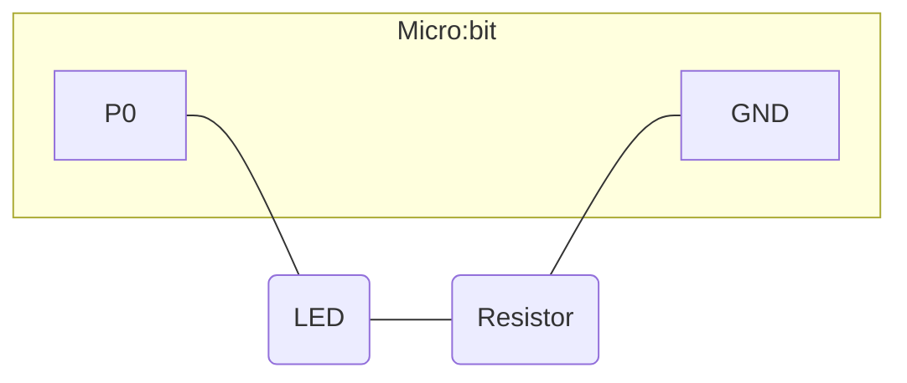

# Aula 1

Aprender sobre entradas (sensores) e saídas (atuadores).

Ligações:



## Experimento 1.1: controle remoto

O objetivo é enviar números, no caso `0` ou `1`, através do sistema de rádio para outro Micro:bit e, assim, controlar remotamente (valores discretos 0 e 1) o pino 0.

Sensores:

- Botões;
- Rádio (recebimento).

Atuadores:

- Rádio (envio);
- Pino;
- Matriz de LEDs.

Código em Python:

```python
def on_received_number(receivedNumber):
    if receivedNumber == 0:
        pins.digital_write_pin(DigitalPin.P0, 0)
        basic.show_icon(IconNames.NO)
    elif receivedNumber == 1:
        pins.digital_write_pin(DigitalPin.P0, 1)
        basic.show_icon(IconNames.YES)
radio.on_received_number(on_received_number)

def on_button_pressed_a():
    radio.send_number(0)
    basic.show_number(0)
input.on_button_pressed(Button.A, on_button_pressed_a)

def on_button_pressed_b():
    radio.send_number(1)
    basic.show_number(1)
input.on_button_pressed(Button.B, on_button_pressed_b)

basic.show_icon(IconNames.HEART)
radio.set_group(1)
```

## Experimento 1.2: bússola

O objetivo é ler a orientação da bússola. Se estiver entre noroeste e nordeste, ativar o pino 0 (valor discreto mínimo); caso contrário, desativar o pino 0 (valor discreto máximo).

Sensores:

- Magnetômetro.

Atuadores:

- Pino;
- Matriz de LEDs.

Código em Python:

```python
basic.show_icon(IconNames.HEART)

def on_forever():
    if input.compass_heading() > 315 or input.compass_heading() < 45:
        pins.digital_write_pin(DigitalPin.P0, 1)
        basic.show_icon(IconNames.YES)
    else:
        pins.digital_write_pin(DigitalPin.P0, 0)
        basic.show_icon(IconNames.NO)
    basic.pause(1000)
basic.forever(on_forever)
```

## Experimento 1.3: sensor de luminosidade

Semelhante ao experimento 1.2, aqui a quantidade de luz percebida pelo sensor acoplado a matriz de LEDs ativa ou desativa o pino 0. A luminosidade tem seu intervalo traduzido para valores discretos entre 0 e 255, e foi atribuído o valor limite 100:

- Entre 0 e 100: ativa o pino 1 (valor discreto máximo);
- Entre 101 e 255: desativa o pino 0 (valor discreto mínimo).

Sensores:

- Sensor de luminosidade.

Atuadores:

- Pino;
- Matriz de LEDs.

Código em Python:

```python
basic.show_icon(IconNames.HEART)

def on_forever():
    if input.light_level() < 100:
        pins.digital_write_pin(DigitalPin.P0, 1)
        basic.show_icon(IconNames.YES)
    else:
        pins.digital_write_pin(DigitalPin.P0, 0)
        basic.show_icon(IconNames.NO)
    basic.pause(1000)
basic.forever(on_forever)
```

## Experimenro 1.4: todas as funções reunidas

Os códigos dos experimentos 1.1, 1.2 e 1.3 foram mesclados em um só.

Sensores:

- Botões;
- Rádio (recebimento);
- Magnetômetro;
- Sensor de luminosidade.

Atuadores:

- Rádio (envio);
- Pino;
- Matriz de LEDs.

Código em Python:

```python
def on_received_number(receivedNumber):
    if receivedNumber == 0:
        pins.digital_write_pin(DigitalPin.P0, 0)
        basic.show_icon(IconNames.NO)
    elif receivedNumber == 1:
        pins.digital_write_pin(DigitalPin.P0, 1)
        basic.show_icon(IconNames.YES)
radio.on_received_number(on_received_number)

def on_button_pressed_a():
    radio.send_number(0)
    basic.show_number(0)
input.on_button_pressed(Button.A, on_button_pressed_a)

def on_button_pressed_b():
    radio.send_number(1)
    basic.show_number(1)
input.on_button_pressed(Button.B, on_button_pressed_b)

def on_forever():
    if input.compass_heading() > 315 or input.compass_heading() < 45 or input.light_level() < 100:
        pins.digital_write_pin(DigitalPin.P0, 1)
        basic.show_icon(IconNames.YES)
    else:
        pins.digital_write_pin(DigitalPin.P0, 0)
        basic.show_icon(IconNames.NO)
    basic.pause(1000)
basic.forever(on_forever)

basic.show_icon(IconNames.HEART)
radio.set_group(1)
```
