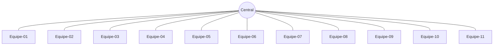

# Aula 3

Definir o controle remoto dos projetos das equipes na feira de ciências.

## Experimento 3.1: controle remoto distribuído para todas as equipes

Nesse cenário, todos os Micro:bits podem enviar e receber comandos.



Código em Python:

```python
def on_received_number(receivedNumber):
    global comando
    if receivedNumber >= equipe * 10 and receivedNumber <= equipe * 10 + 9:
        comando = receivedNumber % (equipe * 10)
        basic.show_number(comando)
radio.on_received_number(on_received_number)

def on_button_pressed_a():
    global equipe
    equipe += 1
    if equipe > 11:
        equipe = 1
    basic.show_number(equipe)
input.on_button_pressed(Button.A, on_button_pressed_a)

def on_button_pressed_ab():
    radio.send_number(equipe * 10 + comando)
input.on_button_pressed(Button.AB, on_button_pressed_ab)

def on_button_pressed_b():
    global comando
    comando += 1
    if comando > 9:
        comando = 0
    basic.show_number(comando)
input.on_button_pressed(Button.B, on_button_pressed_b)

comando = 0
equipe = 0
basic.show_icon(IconNames.HEART)
radio.set_group(1)
equipe = 8
comando = 0
```
