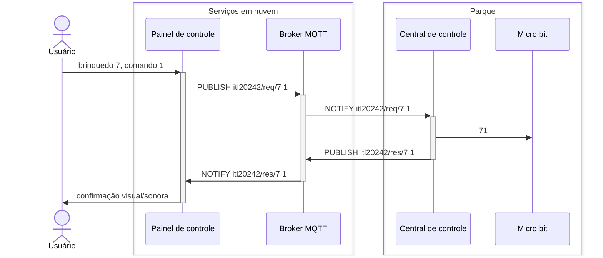

# Parque de diversões

Os visitantes do parque de diversões, a partir do painel de controle (aplicação Web), enviam comandos para a central de controle que, por sua vez, propagam os comandos para os brinquedos.

Para exemplificar o fluxo da mensagens, a seguir um visitante escolhe o brinquedo `7`e comando `1`:

