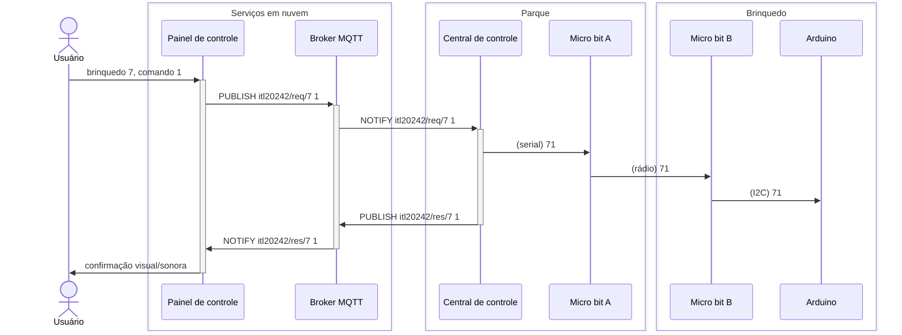
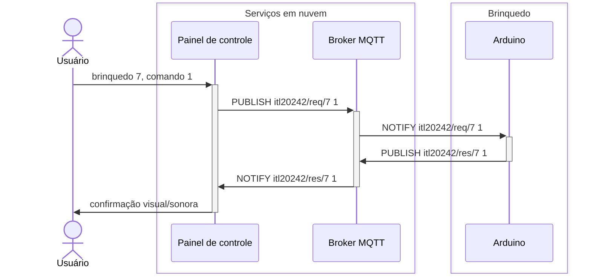

# Parque de diversões

Os visitantes do parque de diversões, a partir do painel de controle (aplicação Web), enviam comandos para a central de controle que, por sua vez, propagam os comandos para os brinquedos.

Para exemplificar o fluxo da mensagens, a seguir dois cenários onde um visitante escolhe o brinquedo `7`e comando `1`:

1. Com o uso de Micro:bit para troca de mensagens:

2. Com o uso de Arduino para troca de mensagens:

O painel de controle está disponível em: https://itl.sj.ifsc.edu.br.
