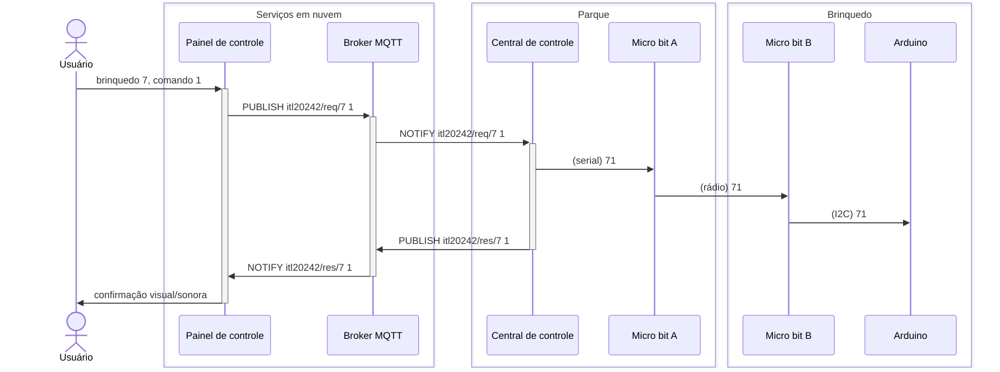
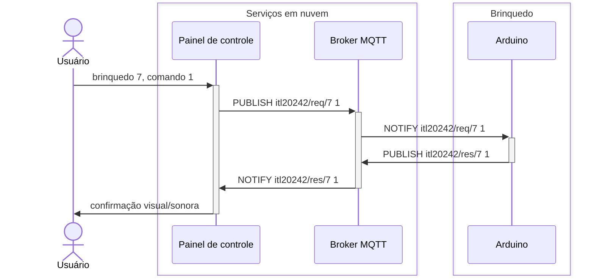

# Parque de diversões

Os visitantes do parque de diversões, a partir do painel de controle ([aplicação Web](https://itl.sj.ifsc.edu.br)), enviam comandos para os brinquedos.

## Painel de controle

A aplicação Web tem código disponível na pasta [painel-de-controle](./painel-de-controle). Está hospedada no servidor da disciplina, onde também está o *broker* MQTT.

### Servidor HTTPS

A configuração do servidor HTTPS, com NGINX e Certbot, é a seguinte:

```nginx
server {
  listen 80;
  listen [::]:80;

  server_name itl.sj.ifsc.edu.br;
  if ($host = itl.sj.ifsc.edu.br) {
    return 301 https://$host$request_uri;
  }
  return 404;
}

server {
  listen [::]:443 http2 ssl ipv6only=on;
  listen 443 http2 ssl;

  server_name itl.sj.ifsc.edu.br;

  ssl_certificate /etc/letsencrypt/live/itl.sj.ifsc.edu.br/fullchain.pem; # managed by Certbot
  ssl_certificate_key /etc/letsencrypt/live/itl.sj.ifsc.edu.br/privkey.pem; # managed by Certbot
  ssl_session_timeout 1d;
  ssl_session_cache shared:MozSSL:10m;
  server_tokens off;
  ssl_session_tickets off;
  ssl_protocols TLSv1.2 TLSv1.3;
  ssl_prefer_server_ciphers on;
  ssl_ciphers ECDHE-ECDSA-AES128-GCM-SHA256:ECDHE-RSA-AES128-GCM-SHA256:ECDHE-ECDSA-AES256-GCM-SHA384:ECDHE-RSA-AES256-GCM-SHA384:ECDHE-ECDSA-CHACHA20-POLY1305:ECDHE-RSA-CHACHA20-POLY1305:DHE-RSA-AES128-GCM-SHA256:DHE-RSA-AES256-GCM-SHA384:DHE-RSA-CHACHA20-POLY1305;
  add_header Strict-Transport-Security "max-age=63072000; includeSubdomains; preload" always;
  ssl_buffer_size 8k;
  ssl_stapling on;
  ssl_stapling_verify on;
  resolver 1.1.1.1 1.0.0.1;

  add_header X-Content-Type-Options nosniff;
  add_header Content-Security-Policy "object-src 'none'; base-uri 'none'; frame-ancestors 'self';";
  add_header Content-Security-Policy "frame-ancestors 'self';";

  location / {
    root /var/www/html/itl20242/parque-de-diversoes/painel-de-controle/;
    try_files $uri $uri/ =404;
  }

  location /mqtt/ {
    proxy_pass http://ip6-localhost:8080/;
    proxy_http_version 1.1;
    proxy_set_header Upgrade $http_upgrade;
    proxy_set_header Connection "Upgrade";
    proxy_set_header Host $host;
  }
}
```

### *Broker* MQTT
Já o *broker* MQTT, implementado com Mosquitto, tem a seguinte configuração adicional:

```ini
listener 1883
listener 8080
protocol websockets
allow_anonymous true
```

Para exemplificar o fluxo da mensagens, há dois cenários a seguir, onde um visitante escolhe, a título de exemplo, o brinquedo `7` e o comando `1`.

## Com o uso de Micro:bit para troca de mensagens

Uma aplicação em Python (Central de controle) é usado para receber a mensagem via MQTT e repassa por USB para o Micro:bit (A). Este, por sua vez, envia por rádio para o Micro:bit do brinquedo (B) onde, por fim, repassa por I2C para o Arduino.



O código fonte da central de controle é este:

```python
from dotenv import load_dotenv
from os import getenv
import paho.mqtt.client as mqtt
from re import compile
import serial

load_dotenv()
mqtt_host = getenv("MQTT_HOST", default="itl.sj.ifsc.edu.br")
mqtt_transport = getenv("MQTT_TRANSPORT", default="websockets")
mqtt_secure = getenv("MQTT_SECURE", default="true") == "true"
mqtt_port = int(getenv("MQTT_PORT", default="443"))
mqtt_timeout = int(getenv("MQTT_TIMEOUT", default="60"))
mqtt_resource = getenv("MQTT_RESOURCE", default="/mqtt/")
mqtt_topic = getenv("MQTT_TOPIC", default="itl20242/req")
serial_port = getenv("SERIAL_PORT", default="/dev/ttyACM0")


def on_connect(client, userdata, flags, reason_code, properties):
    print("Conectado ao broker MQTT")
    client.subscribe(mqtt_topic + "/#")


def on_message(client, userdata, msg):
    print(msg.topic, msg.payload.decode())
    if compile(mqtt_topic + "/1?[0-9]").fullmatch(msg.topic):
        disciplina, sentido, brinquedo = msg.topic.split("/")
        comando = msg.payload.decode()
        mensagem = "".join([brinquedo, comando, "\n"])
        try:
            microbit.write(mensagem).encode()
        except Exception as e:
            print(e)
            print(mensagem)
        mqtt_client.publish(f"{disciplina}/res/{brinquedo}", comando)


if __name__ == "__main__":
    try:
        microbit = serial.Serial(serial_port, 115200)
    except Exception as e:
        print(e)

    mqtt_client = mqtt.Client(
        mqtt.CallbackAPIVersion.VERSION2, transport=mqtt_transport
    )
    mqtt_client.on_connect = on_connect
    mqtt_client.on_message = on_message
    mqtt_client.ws_set_options(path=mqtt_resource)
    if mqtt_secure:
        mqtt_client.tls_set()
    mqtt_client.connect(mqtt_host, mqtt_port, mqtt_timeout)
    mqtt_client.loop_forever()
```

com as seguintes dependências:

```python
pyserial
paho-mqtt
python-dotenv
```

A central de controle, devido às restrições de distância de rádio e I<sup>2</sup>C, deve estar próximo dos brinquedos, preferencialmente no centro físico do parque.

## Com o uso de Arduino para troca de mensagens

Este cenário é mais simples: apenas o Arduino do brinquedo é usado para receber os comandos via MQTT - diretamente do painel de controle (aplicação Web).



Nesse caso, o Arduino deve possuir suporte a IP/MQTT, seja por Ethernet ou Wi-Fi. No projeto da disciplina, a família ESP32 é considerada por ter Wi-Fi nativo - como no seguinte código:

```c++
#include <WiFi.h>
#include <PubSubClient.h>

// Pinagem para ESP32
#define LED_BUILTIN 2
#define MOTOR 12

// Wi-Fi
#define SSID "itl"
#define PASSWORD "itl20242"

// MQTT
#define MQTT_SERVER "itl.sj.ifsc.edu.br"
#define MQTT_PORT 1883
#define MQTT_CLIENT_ID "brinquedo-5"
#define MQTT_TOPIC_REQ "itl20242/req/5"
#define MQTT_TOPIC_RES "itl20242/res/5"

// Cliente Wi-Fi e MQTT
WiFiClient espClient;
PubSubClient client(espClient);

// Função de callback para receber mensagens MQTT
void callback(char *topic, byte *payload, unsigned int length)
{
  // Pisca o LED embutido 3 vezes em intervalos de 100ms
  for (int i = 0; i < 3; i++)
  {
    digitalWrite(LED_BUILTIN, LOW);
    delay(100);
    digitalWrite(LED_BUILTIN, HIGH);
    delay(100);
  }

  // Verificar o valor da mensagem
  if (payload[0] == '0')
  {
    Serial.println("Desligando o motor...");

    // Desligar o motor
    digitalWrite(MOTOR, LOW);

    // Publicar no tópico MQTT que o comando deu certo
    client.publish(MQTT_TOPIC_RES, "0");
  }
  else if (payload[0] == '1')
  {
    Serial.println("Ligando o motor...");

    // Ligar o motor
    digitalWrite(MOTOR, HIGH);

    // Publicar no tópico MQTT que o comando deu certo
    client.publish(MQTT_TOPIC_RES, "1");
  }
}

void setup()
{
  // Configurar os pinos, LED embutido e motor, como saída
  pinMode(LED_BUILTIN, OUTPUT);
  pinMode(MOTOR, OUTPUT);

  // Interface serial
  Serial.begin(9600);

  // Wi-Fi
  WiFi.begin(SSID, PASSWORD);
  while (WiFi.status() != WL_CONNECTED)
  {
    delay(1000);
    Serial.println("Conectando ao Wi-Fi...");
  }
  Serial.println("Conectado ao Wi-Fi!");

  // Conexão com o broker MQTT
  client.setServer(MQTT_SERVER, MQTT_PORT);
  client.setCallback(callback);
}

void loop()
{
  // Verificar se está conectado no broker MQTT
  if (!client.connected())
  {
    // Desligar o LED embutido da placa
    digitalWrite(LED_BUILTIN, LOW);

    // (Re)Conectar com o broker MQTT, se necessário
    if (client.connect(MQTT_CLIENT_ID))
    {
      Serial.println("Conectado ao broker MQTT!");

      // Ligar o LED embutido da placa
      digitalWrite(LED_BUILTIN, HIGH);

      // Inscrever no tópico de requisição
      client.subscribe(MQTT_TOPIC_REQ);
    }
    else
    {
      Serial.print("Falha na reconexão com o broker MQTT. Tentando novamente em 5 segundos...");
      delay(5000);
    }
  }

  // Loop para manter a conexão MQTT ativa
  client.loop();
}
```

onde os comandos `0` e `1` são usados para desligar e ligar o motor (pino 12), respectivamente.

Como dependência de código, projetado para ESP32, há apenas a biblioteca [`PubSubClient`](https://docs.arduino.cc/libraries/pubsubclient/).
